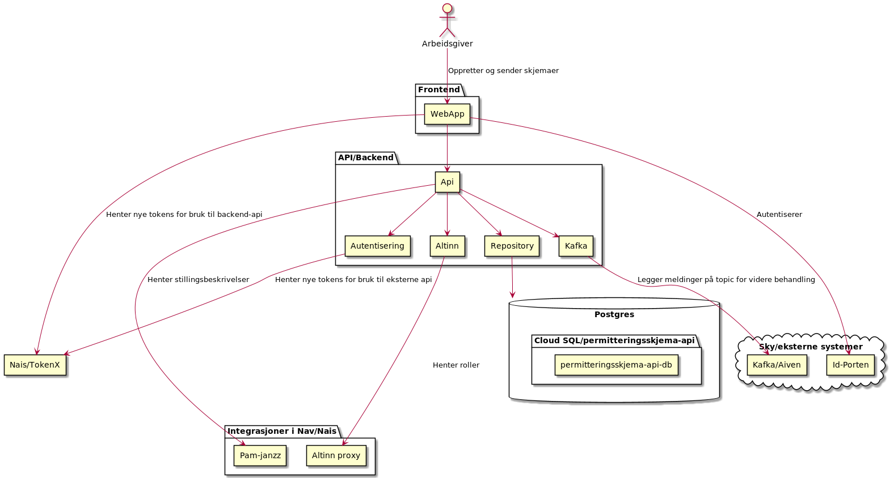

# Skjema for melding av masseoppsigelser, permitteringer og nedbemanninger

## Bakgrunn og motivasjon for applikasjonen
Arbeidsgivere er lovpålagd å sende beksjed til NAV ved masseoppsigelse, permittering eller nedbemanning av 10 eller flere ansatte. Arbeidsgivere kan gjøre det digitalt med denne applikasjonen.

**permittering**
Frontend for permitteringsskjema. Arbeidsgivere bruker denne applikasjonen til å sende in skjema for melding om masseoppsigelse, permittering eller nedbemanning.

**permitteringsskjema-api**
Backend for permitteringsskjema. Java-basert rest-api som lagrer skjemaer i database og legger de på kafka-topic.

## Sikkerhet og autentisering
Innlogging med ID-porten. Applikasjonen benytter seg av TokenX for å hente ny access token til de ulike apiene som benyttes. Både backend for applikasjonen og videre i verdikjeden.
## Teknisk
React, Java, Spring, Kafka, Postgres.

Deesignen er relativt standard lagdelt med api, repository og diverse integrasjoner. Spring sitt meldingssystem brukes internt i applikasjonen.

### Tekniske skisser
